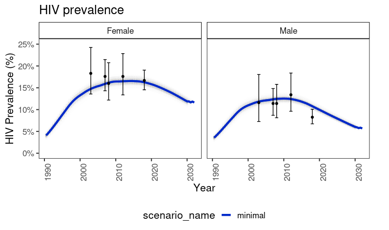

# NYANZA MODEL

## About the Nyanza Model

The Nyanza model was developed to simulate HIV transmission in six high-prevalence counties in western Kenya.
## Software

* EMOD version [link]
* EMOD binary [link]

## Data

* Demography: UN WPP
* Calibration targets: DHS and PHIA
    * Prevalence
    * ART Distribution
* ART Eligibility Timeline: Kenya MOH
* Traditional VMMC: DHS

## Calibration

Last updated on 2023-03-01 by David Kaftan

## Configuration Files

* [Calibration Targets Ingest File](Data/calibration_ingest_form_Nyanza.xlsm)
* [Campaign File](InputFiles/Templates/campaign_Nyanza_baseline_202301.json)
* [Demographics](InputFiles/Static/Demographics.json)
* [Other Template Files](InputFiles/Templates)

## Publications

* [EMOD tutorial](Tutorial/tutorial.md)